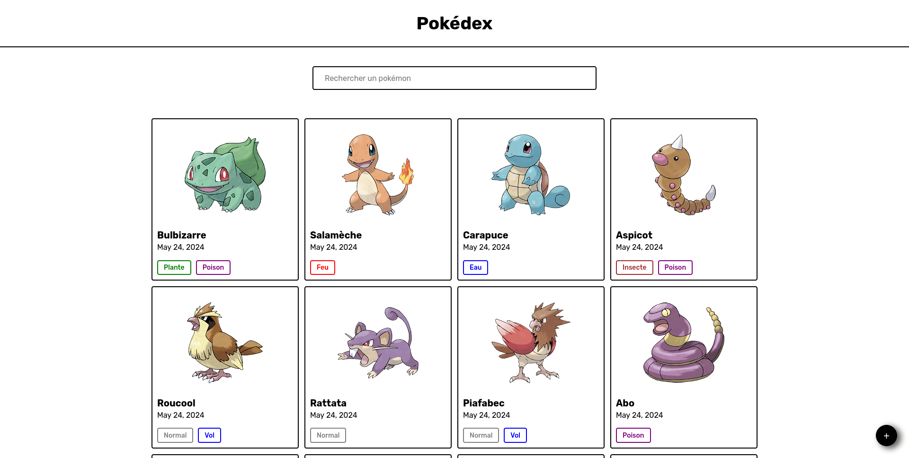

# Pokédex



Bienvenue dans l'application Pokémon Form! Cette application permet de gérer les informations des Pokémon via un formulaire interactif.

## Démo en direct

Découvrez la démo en direct de l'application [ici.](https://ng-pokemon-app-ca2d5.web.app)

## Fonctionnalités

- **Ajouter un Pokémon** : Remplissez les informations nécessaires pour ajouter un nouveau Pokémon.
- **Modifier un Pokémon** : Mettez à jour les informations existantes d'un Pokémon.
- **Validation en temps réel** : Les champs du formulaire sont validés en temps réel pour garantir des entrées correctes.
- **Types de Pokémon** : Sélectionnez les types de Pokémon avec des cases à cocher dynamiques.

## Technologies Utilisées

- **Angular** : Framework principal pour le développement de l'application.
- **TypeScript** : Langage de programmation utilisé pour écrire le code Angular.
- **HTML & CSS** : Pour la structure et le style de l'application.
- **Firebase** : Pour la gestion des données et le hosting.

## Installation

1. Clonez le dépôt :
   ```bash
   git clone https://github.com/votre-utilisateur/pokemon-form-app.git
   ```
2. Accédez au répertoire du projet :
   ```bash
   cd pokemon-form-app
   ```
3. Installez les dépendances :
   ```bash
   npm install
   ```
4. Démarrez l'application :
   ```bash
   ng serve
   ```
5. Ouvrez votre navigateur et accédez à `http://localhost:4200`.

## Utilisation

1. Remplissez le formulaire avec les informations du Pokémon.
2. Cliquez sur le bouton "Valider" pour soumettre le formulaire.
3. Les messages d'erreur s'afficheront en cas de validation incorrecte.

## Contribuer

Les contributions sont les bienvenues! Veuillez suivre les étapes ci-dessous pour contribuer :

1. Forkez le projet.
2. Créez une branche pour votre fonctionnalité (`git checkout -b feature/ma-fonctionnalité`).
3. Commitez vos modifications (`git commit -m 'Ajout de ma fonctionnalité'`).
4. Poussez votre branche (`git push origin feature/ma-fonctionnalité`).
5. Ouvrez une Pull Request.

## Merci d'avoir regardé ce projet!
